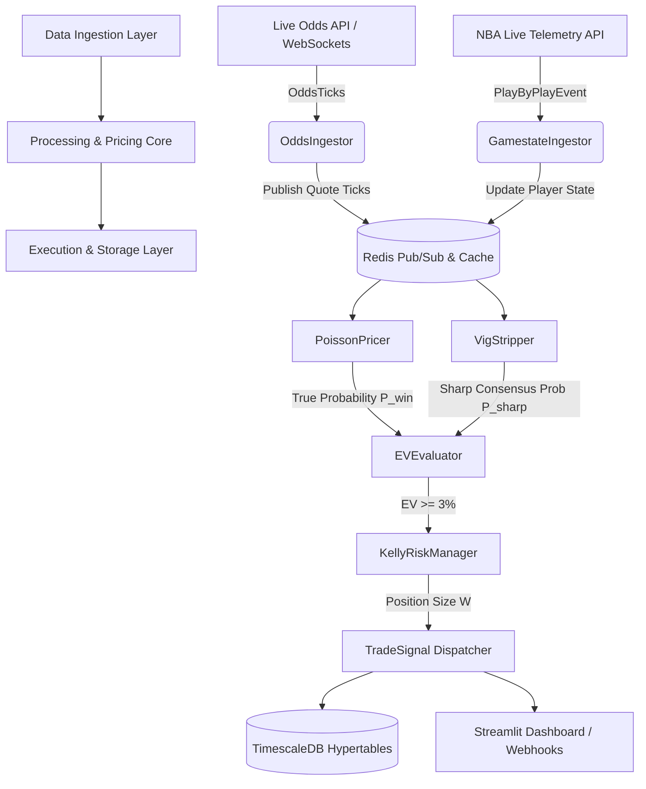

# prop-engine

> **Live Basketball Player Props Pricing Engine & +EV Execution Bot**

[](https.python.org)
[](LICENSE)
[](https://streamlit.io)
[](https://www.timescale.com)

`prop-engine` is a high-frequency quantitative sports trading system designed for real-time NBA player prop markets (points, rebounds, assists). It ingests live play-by-play game telemetry and multi-bookmaker odds ticks, dynamically re-prices player Over/Under contracts using an **Inhomogeneous Poisson Process**, strips bookmaker margins ("vig/juice") using Shin's Asymmetric Information Model, and identifies positive expected value (**+EV**) mispricings across retail sportsbooks.

---

## 🏀 Key Features

- **Strict API Validation**: Only makes external HTTP calls to The-Odds-API when passed verified 32-character hexadecimal event hashes directly returned by live event endpoints.
- **Live Data Pipeline**: Ingests real-time game telemetry parsed from ESPN and live sports feeds.
- **Dynamic Rate Pricing (Inhomogeneous Poisson Process)**: Calculates real-time stat accumulation rates $\lambda_{rem}(t)$ that dynamically decay when players experience foul trouble or when games reach late blowout states.
- **Advanced De-Juicing (Margin Stripping)**: Extracts true market consensus probabilities from sharp books (Pinnacle/Circa) using:
  - **Multiplicative De-Juicing** (Standard proportional)
  - **Power Method** (Adjusts for favorite-longshot bias)
  - **Shin's Method** (Models insider trading & information asymmetry)
- **+EV Trade Detection**: Scans soft/retail books (DraftKings, FanDuel, BetMGM) for price latency, flagging edges where Expected Value $EV \ge 3\%$ and win probability exceeds sharp consensus by $\ge 1.5\%$.
- **Fractional Kelly Sizing**: Calculates optimal risk-managed wager sizes using Quarter-Kelly ($\alpha = 0.125$) subject to strict exposure caps.

---

## 🏗️ System Architecture



### Sequence Flow
1. **Telemetry Feed**: [gamestate_ingestor.py](file:///home/mateo/prop-engine/src/ingestion/gamestate_ingestor.py) tracks game clock, period, fouls, and stat accumulation.
2. **Quote Feed**: [odds_ingestor.py](file:///home/mateo/prop-engine/src/ingestion/odds_ingestor.py) fetches real-time quotes across bookmakers.
3. **De-Juicing**: [vig_stripper.py](file:///home/mateo/prop-engine/src/pricing/vig_stripper.py) strips vig from sharp sportsbooks.
4. **Quant Pricing**: [poisson_pricer.py](file:///home/mateo/prop-engine/src/pricing/poisson_pricer.py) computes dynamic Over/Under probabilities.
5. **Arbitrage Check**: [ev_evaluator.py](file:///home/mateo/prop-engine/src/execution/ev_evaluator.py) flags soft book latency.
6. **Risk Management**: [kelly_sizer.py](file:///home/mateo/prop-engine/src/execution/kelly_sizer.py) computes bankroll wager stakes.
7. **Storage & UI**: [postgres_client.py](file:///home/mateo/prop-engine/src/db/postgres_client.py) logs to TimescaleDB, rendering via [dashboard.py](file:///home/mateo/prop-engine/src/dashboard.py).

---

## 📂 Repository Structure

```text
prop-engine/
├── docs/                      # Architecture & sequence SVG diagrams
│   ├── architecture.svg
│   └── sequence.svg
├── sql/                       # TimescaleDB DDL schema definitions
│   └── init_schema.sql
├── src/                       # Main Python codebase
│   ├── db/                    # TimescaleDB & Redis async database clients
│   │   ├── db_init.py
│   │   ├── postgres_client.py
│   │   └── redis_client.py
│   ├── execution/             # EV evaluation & Kelly bankroll risk management
│   │   ├── alert_dispatcher.py
│   │   ├── ev_evaluator.py
│   │   └── kelly_sizer.py
│   ├── ingestion/             # Async HTTP & WebSocket telemetry clients
│   │   ├── game_finder.py
│   │   ├── gamestate_ingestor.py
│   │   └── odds_ingestor.py
│   ├── models/                # Pydantic v2 domain & state data schemas
│   │   └── domain.py
│   ├── pricing/               # Inhomogeneous Poisson & De-juicing math modules
│   │   ├── poisson_pricer.py
│   │   └── vig_stripper.py
│   ├── config.py              # Centralized environment settings
│   ├── dashboard.py           # Streamlit web UI monitoring dashboard
│   ├── engine_worker.py       # Continuous background daemon runner
│   └── main.py                # Standalone simulation pipeline entrypoint
├── tests/                     # Automated unit test suite (pytest)
│   ├── test_kelly_sizer.py
│   ├── test_poisson_pricer.py
│   └── test_vig_stripper.py
├── docker-compose.yml         # Container configuration (TimescaleDB & Redis)
├── pyproject.toml             # Build system & dependency specifications
├── requirements.txt           # Python dependency requirements
├── run.sh                     # Unified application startup script
└── SYSTEM_DOCUMENTATION.md    # In-depth architectural & mathematical specification
```

---

## 🚀 Quickstart Guide

### Prerequisites
- **Python 3.11+**
- **Docker & Docker Compose**

### 1. Environment Setup
Clone the repository and copy the environment template:
```bash
cp .env.example .env
```

### 2. Launch Services (Database & Redis)
Spin up TimescaleDB and Redis containers in background mode:
```bash
docker compose up -d
```

### 3. Run Automated Tests
Run the unit test suite to verify math and pricing calculations:
```bash
.venv/bin/python -m pytest tests/
```

### 4. Run the Engine & Dashboard
You can run the entire system (engine daemon + Streamlit dashboard) using the unified runner script:
```bash
chmod +x run.sh
./run.sh
```

Or run components individually:
```bash
# Run background engine worker daemon
.venv/bin/python -m src.engine_worker

# In a separate terminal, run the Streamlit dashboard
.venv/bin/streamlit run src/dashboard.py
```

---

## 📐 Mathematical Formulation

### 1. Inhomogeneous Poisson Rate Equation
$$\lambda_{rem}(t) = \mu_{base} \times R_{proj}(t) \times \gamma_{pace}(t) \times \gamma_{foul}(t) \times \gamma_{blowout}(t)$$

### 2. Expected Value (+EV)
$$EV = P_{win} \times (O_{book} - 1) - (1 - P_{win}) = P_{win} \times O_{book} - 1$$

### 3. Fractional Kelly Stake
$$W = \min\left( 0.125 \times \frac{EV}{O_{\text{book}} - 1} \times \text{Bankroll}, \, 0.025 \times \text{Bankroll}, \, \text{Max Wager Cap} \right)$$

---

## 📄 System Documentation

For full mathematical proofs, database schema details, Shin's insider trading model derivations, and architectural deep-dives, see **[SYSTEM_DOCUMENTATION.md](file:///home/mateo/prop-engine/SYSTEM_DOCUMENTATION.md)**.

---

## ⚖️ License

Distributed under the MIT License. See `LICENSE` for details.
