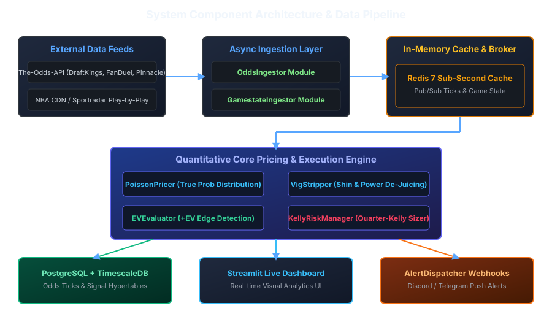
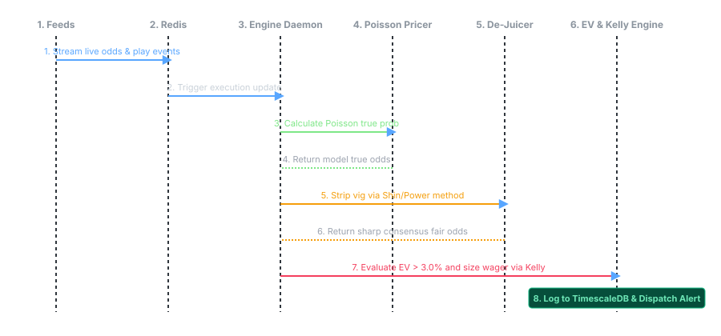

# prop-engine: Live Basketball Player Props Pricing Engine & +EV Execution Bot

---

## 1. Domain Primer for Software Engineers (Non-Sports, Non-Trading)

If you are a Software Engineer with zero background in sports or trading, this section maps the domain concepts to systems and logic you already know.

### 1.1 The Environment: Basketball & NBA Rules
Think of a basketball game as a **48-minute execution loop** divided into four 12-minute quarters (plus possible overtime if the score is tied). 
During this loop, players accumulate integer events (stats). The core stats we track are:
* **Points**: When a player scores a basket (adds $+1$, $+2$, or $+3$ points to the team score).
* **Rebounds**: When a player catches the ball after someone misses a shot.
* **Assists**: When a player passes the ball to a teammate who immediately scores.

#### Dynamic Runtime Interrupts (Fouls & Blowouts)
A player's rate of accumulating stats is not constant. It is affected by two major game states:
1. **Foul Trouble**: If a player commits **6 fouls**, they are permanently ejected (terminated). If a player commits fouls too quickly (e.g., 3 fouls in the first half), the coach benches them to save them for later. *System impact: Benchings drastically reduce the player's remaining active runtime.*
2. **Blowout Risk**: If the score difference is very large late in the game (e.g., one team is winning by $+20$ in the 4th quarter), the coach benches the star players ("garbage time") to prevent injury. *System impact: Rest benchings truncate the player's remaining runtime to 0.*

---

### 1.2 The Marketplace: Sports Betting & Trading
In this project, sportsbooks act as **exchanges** listing binary options contracts called **Player Props**.

#### Contracts (Over/Under Lines)
An exchange lists a contract threshold, such as **Stephen Curry Points: 28.5**.
* You can buy the **OVER** contract ( Curry scores 29 or more points).
* You can buy the **UNDER** contract ( Curry scores 28 or fewer points).
Contracts pay out based on decimal odds. For example, odds of `2.00` means a successful $100 wager returns $200 (a $100 net profit).

#### The Vig (Juice / Transaction Fee / Spread)
Exchanges don't offer fair odds. They charge a built-in transaction fee called the **Vig** (overround). 
If the true probability of an event is $50\% / 50\%$, a fair broker would offer `2.00 / 2.00` odds. Instead, bookmakers offer `1.90 / 1.90`.
If you convert these odds back to implied probabilities ($1 / 1.90 = 52.6\%$), they sum to $105.2\%$. The extra $5.2\%$ is the **Vig**—the broker's built-in fee. 
* **De-Juicing** is the process of striping out this $5.2\%$ fee to find the market's true consensus probability.

#### Market Actors: Sharp vs. Soft Books
* **Sharp Books (Market Makers)**: High-volume exchanges (like Pinnacle) with very low fees. They have highly accurate odds because they dynamically adjust their lines using smart order flow. We treat their de-juiced lines as the **consensus fair market price**.
* **Soft Books (Retail Brokers)**: Consumer exchanges (like DraftKings, FanDuel). They charge higher fees, have slow update cycles, and fail to adjust quickly to in-game event telemetry. This latency creates **arbitrage-like inefficiencies** that our bot exploits.

---

### 1.3 The Trading Engine Math

#### 1. Inhomogeneous Poisson Process (Rate Estimator)
To price a prop, we need to calculate the probability of a player hitting their Over. Because points, rebounds, and assists are discrete event counts occurring over a known remaining time window, we model them using a **Poisson Process**. 
* Unlike a standard Poisson process (which assumes a constant event rate), our engine is **inhomogeneous** because the event rate ($\lambda$) dynamically scales down when players get into foul trouble or when games become blowouts.

#### 2. Expected Value (+EV)
This is the mathematical expectation of profitability. If you make a bet with $+10\%$ EV one thousand times, law of large numbers guarantees you will make a profit.
$$EV = (\text{True Win Probability} \times \text{Payout Odds}) - 1$$
We only execute trades when $EV \ge 3\%$.

#### 3. Kelly Criterion (Risk Management)
How much capital should you allocate to a trade? If you bet too little, your bankroll grows too slowly. If you bet too much, a bad streak of variance will wipe you out (ruin). 
* The **Kelly Criterion** calculates the mathematically optimal bet size to maximize logarithmic growth of capital while keeping the risk of total ruin at $0\%$. We scale this down to **Quarter-Kelly** ($\alpha = 0.125$) to protect against modeling errors.

---

## 2. Full Architecture & Component Blueprint



### Component Details
1. **`src/models/domain.py`**: Strict Pydantic v2 domain schemas (`OddsTick`, `PlayByPlayEvent`, `PlayerGameState`, `ModelPricingResult`, `TradeSignal`).
2. **`src/ingestion/odds_ingestor.py`**: Asynchronous HTTP client fetching live quotes for `player_points`, `player_rebounds`, and `player_assists` with strict 32-character hexadecimal API hash verification.
3. **`src/ingestion/gamestate_ingestor.py`**: Parses live play-by-play events, tracks remaining quarter clock, and updates accumulated box score stats.
4. **`src/ingestion/game_finder.py`**: Automatically discovers active and upcoming NBA/WNBA game IDs and metadata across live feeds, pairing ESPN telemetry with Odds-API event hashes.
5. **`src/pricing/vig_stripper.py`**: Removes bookmaker margin (vig) using Multiplicative, Power Method, and Shin's Information Asymmetry algorithms.
6. **`src/pricing/poisson_pricer.py`**: Inhomogeneous Poisson distribution pricing engine calculating dynamic rate $\lambda_{rem}(t)$ with foul trouble and blowout decay adjustments.
7. **`src/execution/ev_evaluator.py`**: Evaluates mathematical expected value ($EV = P_{win} \cdot O_{book} - 1$) and edge over market consensus.
8. **`src/execution/kelly_sizer.py`**: Calculates optimal position size using Fractional Kelly Criterion ($\alpha = 0.125$) subject to exposure caps.
9. **`src/execution/alert_dispatcher.py`**: Dispatches high-priority +EV trade alerts to external webhooks (e.g. Discord, Telegram).
10. **`src/db/redis_client.py`**: Async Redis client handling state caching and Pub/Sub channel notifications.
11. **`src/db/postgres_client.py`**: Async TimescaleDB client inserting tick logs into hypertable partitions.
12. **`src/db/db_init.py`**: Database initialization utility executing SQL DDL schemas and creating hypertables.
13. **`src/engine_worker.py`**: Continuous production background daemon orchestrating the end-to-end execution loop.
14. **`src/dashboard.py`**: Streamlit web interface for game/roster discovery, real-time pricing telemetry, and +EV trade signal monitoring.
15. **`run.sh`**: Shell launcher script running the background engine daemon and Streamlit dashboard concurrently.

---

## 3. End-to-End Execution Sequence Flow



---

## 4. Mathematical Models & Statistical Foundations

### 4.1 Inhomogeneous Poisson Pricing Model
Player stat accumulation (e.g., points scored $X_t$) is modeled as an **Inhomogeneous Poisson Process** with dynamic rate parameter $\lambda_{rem}(t)$:

$$\lambda_{rem}(t) = \mu_{base} \times R_{proj}(t) \times \gamma_{pace}(t) \times \gamma_{foul}(t) \times \gamma_{blowout}(t)$$

Where:
* **$\mu_{base}$**: Baseline stat accumulation rate per minute (e.g., $0.85$ points/min for Stephen Curry).
* **$R_{proj}(t)$**: Projected remaining playing time in minutes.
* **$\gamma_{pace}(t)$**: Current game pace multiplier vs pre-game expectation.
* **$\gamma_{foul}(t)$**: Foul trouble penalty factor:
  $$\gamma_{foul}(t) = \begin{cases} 
  0.60 & \text{if Period 1 and Fouls } \ge 2 \\
  0.70 & \text{if Period 2 and Fouls } \ge 3 \\
  0.75 & \text{if Period 3 and Fouls } \ge 4 \\
  0.80 & \text{if Period } \ge 4 \text{ and Fouls } \ge 5 \\
  1.00 & \text{otherwise}
  \end{cases}$$
* **$\gamma_{blowout}(t)$**: Sigmoidal decay of remaining starter minutes when score differential $|\Delta| > 18$ in Q4:
  $$\gamma_{blowout}(t) = \max\left(0.30, 1.0 - 0.25 \times \frac{|\Delta| - 18}{10}\right)$$

#### Cumulative Probability Mass Calculation
For an Over/Under line at threshold $K + 0.5$ (e.g., $28.5$) with current stat tally $S_t$:
$$\text{Needed Remaining Stats: } k_{needed} = \lfloor K \rfloor - S_t$$

If $k_{needed} < 0$, the Over has already hit ($P_{over} = 1.0$). Otherwise, using the Poisson Cumulative Distribution Function (CDF):

$$P(X_{final} \le K) = \sum_{j=0}^{k_{needed}} \frac{(\lambda_{rem})^j e^{-\lambda_{rem}}}{j!}$$

$$P_{under} = P(X_{final} \le K), \quad P_{over} = 1 - P_{under}$$

$$\text{Fair Decimal Odds: } O_{fair\_over} = \frac{1}{P_{over}}, \quad O_{fair\_under} = \frac{1}{P_{under}}$$

---

### 4.2 Bookmaker Vig Removal (De-Juicing Models)

Bookmakers add a profit margin (vig/overround $M$). To establish the consensus market fair probability from sharp books (Pinnacle/Circa), we implement three algorithms:

#### 1. Multiplicative De-Juicing (Proportional)
Given decimal odds $(O_1, O_2)$ with implied probabilities $p_1' = 1/O_1$, $p_2' = 1/O_2$, and overround $M = p_1' + p_2' - 1$:
$$p_1 = \frac{p_1'}{1 + M}, \quad p_2 = \frac{p_2'}{1 + M}$$

#### 2. Power Method De-Juicing (Favorite-Longshot Bias)
Solves for exponent $k$ such that the power-scaled probabilities sum to 1:
$$(p_1')^k + (p_2')^k = 1$$
We solve for $k$ using **Brent's Root-Finding Method** (`scipy.optimize.brentq`), giving de-juiced probabilities $p_1 = (p_1')^k$ and $p_2 = (p_2')^k$.

#### 3. Shin's De-Juicing Method (Information Asymmetry Model)
Assumes a proportion $z$ of informed traders (insider knowledge). Shin's formula solves for $z$:
$$z = \frac{S - 1}{S \times (O_1 + O_2 - 2)}$$
Where $S = p_1' + p_2'$. The true probability $p_1$ is:
$$p_1 = \frac{\sqrt{z^2 + 4(1-z) \frac{(p_1')^2}{S}} - z}{2(1-z)}$$

---

### 4.3 Trade Signal Execution Thresholds

A quote is flagged as a high-priority **+EV Trade Signal** if and only if it satisfies both criteria:

$$EV \ge \text{Min EV Threshold} \quad (0.03) \quad \text{AND} \quad (P_{\text{win}} - P_{\text{sharp}}) \ge 0.015$$

### 4.4 Risk Management & Fractional Kelly Position Sizing

To protect against modeling variance and market shocks, position sizes are capped using Quarter-Kelly ($\alpha = 0.125$) and maximum bankroll percentage bounds:

$$\text{Recommended Wager: } W = \min\left( f_{\text{fractional}} \times B, \quad 0.025 \times \text{Bankroll}, \quad \text{Max Wager Cap} \right)$$
Where $B$ is active bankroll (e.g., $10,000).

---

## 5. Database Schema & TimescaleDB Hypertables

### 1. `odds_ticks` Hypertable
Stores tick-level quote movements partitioned by `timestamp`:
```sql
CREATE TABLE odds_ticks (
    timestamp TIMESTAMPTZ NOT NULL,
    game_id VARCHAR(64) NOT NULL,
    player_id VARCHAR(64) NOT NULL,
    player_name VARCHAR(128) NOT NULL,
    stat_type VARCHAR(32) NOT NULL,
    bookmaker VARCHAR(64) NOT NULL,
    line NUMERIC(5, 2) NOT NULL,
    over_price NUMERIC(6, 2) NOT NULL,
    under_price NUMERIC(6, 2) NOT NULL,
    implied_over_prob NUMERIC(6, 4),
    implied_under_prob NUMERIC(6, 4)
);
SELECT create_hypertable('odds_ticks', 'timestamp');
```

### 2. `trade_signals` Hypertable
Stores all generated execution signals with composite primary key `(signal_id, timestamp)`:
```sql
CREATE TABLE trade_signals (
    timestamp TIMESTAMPTZ NOT NULL,
    signal_id VARCHAR(64) NOT NULL,
    game_id VARCHAR(64) NOT NULL,
    player_id VARCHAR(64) NOT NULL,
    player_name VARCHAR(128) NOT NULL,
    stat_type VARCHAR(32) NOT NULL,
    side VARCHAR(8) NOT NULL,
    line NUMERIC(5, 2) NOT NULL,
    bookmaker VARCHAR(64) NOT NULL,
    bookmaker_odds NUMERIC(6, 2) NOT NULL,
    fair_odds NUMERIC(6, 2) NOT NULL,
    ev_percent NUMERIC(6, 4) NOT NULL,
    kelly_fraction NUMERIC(6, 4) NOT NULL,
    recommended_wager NUMERIC(10, 2) NOT NULL,
    consensus_fair_prob NUMERIC(6, 4) NOT NULL,
    status VARCHAR(32) DEFAULT 'LOGGED',
    PRIMARY KEY (signal_id, timestamp)
);
SELECT create_hypertable('trade_signals', 'timestamp');
```

---

## 6. How to Run, Test, and Verify

### Prerequisites
* Docker & Docker Compose
* Python 3.11+

### Quickstart Commands
```bash
# 1. Start Database & Redis Services
docker compose up -d

# 2. Activate Virtual Environment
source .venv/bin/activate

# 3. Run Automated Unit Test Suite (7/7 Tests)
pytest tests/

# 4. Run Background Engine Worker
python -m src.engine_worker

# 5. Launch Streamlit UI Dashboard
streamlit run src/dashboard.py

# 6. Verify Database Storage
python scripts/verify_db.py
```

---

## 7. Recommended Learning & Study References

To fully master the concepts and mathematics driving this system, we recommend the following academic papers, books, and resources:

### 7.1 Probability Models & Stochastic Processes
* **Poisson Processes**: 
  - [Wikipedia - Non-homogeneous Poisson Process](https://en.wikipedia.org/wiki/Poisson_point_process#Non-homogeneous_Poisson_point_process): Core mathematical framework for event counting over time.
  - [MIT OpenCourseWare - Introduction to Stochastic Processes](https://ocw.mit.edu/courses/18-445-introduction-to-stochastic-processes-spring-2015/): Lecture notes and exercises on Poisson processes and Markov chains.

### 7.2 Bookmaker Vig Removal & De-Juicing Models
* **Shin's Asymmetric Information Model**:
  - *Paper Reference*: Shin, H. S. (1993). *Measuring the Incidence of Insider Trading in a Market for State-Contingent Claims*. The Economic Journal, 103(420), 1141-1153.
  - [Shin's Method Overview & Calculations](https://en.wikipedia.org/wiki/Odds_compiler): Explanation of the information asymmetry parameter $z$.
* **Power Method (Favorite-Longshot Bias)**:
  - [Wikipedia - Favorite-Longshot Bias](https://en.wikipedia.org/wiki/Favourite-longshot_bias): Why retail sportsbooks artificially inflate longshot odds.

### 7.3 Risk Management & Capital Allocation
* **The Kelly Criterion**:
  - [Wikipedia - Kelly Criterion](https://en.wikipedia.org/wiki/Kelly_criterion): Mathematical formulation of capital allocation.
  - *Thorp, E. O. (2008)*. [The Kelly Criterion in Blackjack, Sports Betting, and the Stock Market](http://www.eothorp.com/wp-content/uploads/2015/05/09_KellyCriterion2008.pdf): The definitive paper on using Kelly sizing in financial and gambling markets.

### 7.4 Quantitative Sports Trading
* **Industry Literature**:
  - *The Logic of Sports Betting* (Book by Ed Miller & Matthew Davidow): Excellent primer explaining the structural difference between retail (soft) and market-making (sharp) books.
  - [Pinnacle Betting Resources](https://www.pinnacle.com/en/betting-resources/articles): Deep-dive articles covering de-juicing, Poisson distribution pricing, and beating the closing line value.
